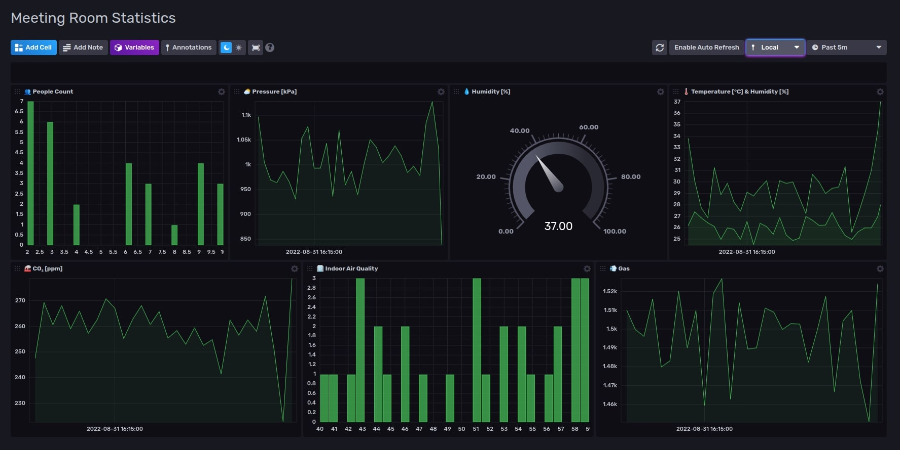

# Environmental monitoring with Arduino Pro

This project is a proof of concept for demonstrating environmental monitoring of offices by using the Arduino Pro Ecosystem.

For monitoring the environmental conditions we have chosen the Arduino Nicla Sense ME which is designed to easily analyze motion and the surrounding environment – hence the “M” and “E” in the name. It measures rotation, acceleration, pressure, humidity, temperature, air quality, and CO2 levels by introducing completely new Bosch Sensortec sensors on the market.

For monitoring the number of people in each room we have chosen the Arduino Nicla Vision which combines a powerful STM32H747AII6 Dual ARM® Cortex® M7/M4 IC processor with a 2MP color camera that supports TinyML, as well as a smart 6-axis motion sensor, integrated microphone, and distance sensor.

For the gateway we have chosen the Portenta X8 that is a powerful, industrial-grade SOM with Linux OS preloaded onboard, capable of running device-independent software thanks to its modular container architecture. It features an NXP® i.MX 8M Mini Cortex®-A53 quad-core, up to 1.8GHz per core + 1x Cortex®-M4 up to 400MHz, plus the STMicroelectronics STM32H747 dual-core Cortex®-M7 up to 480Mhz +M4 32 bit Arm® MCU up to 240Mhz.

The dashboard can be visualized by accessing the InfluxDB interface on the Portenta X8 IP on port 8086 in a browser on another computer (for example http://192.168.1.199:8086/).

## Getting Started

These instructions will give you a copy of the project up and running on your local machine for development and testing purposes. 

### Prerequisites

Hardware requirements: 
- [Nicla Sense Me](https://www.arduino.cc/pro/hardware/product/nicla-sense-me)
- [Nicla Vision](https://www.arduino.cc/pro/hardware/product/nicla-vision)
- [Portenta X8](https://www.arduino.cc/pro/hardware/product/portenta-x8)

Software requirements: 
- [Arduino IDE](https://www.arduino.cc/en/software)
- [Open MV](https://openmv.io/pages/download)
- [Edge Impulse free account](https://studio.edgeimpulse.com/signup)

Edge Impulse project link: https://studio.edgeimpulse.com/public/130101/latest

### Installing

#### Nicla Sense ME:
- install the Arduino IDE and the Nicla Sense ME board in it by following the steps in this [article](https://docs.arduino.cc/tutorials/nicla-sense-me/getting-started)
- clone this repository and set the workspace path in the Nicla Sense ME folder
- connect the board to your laptop, then compile and upload the ble_sense_send sketch

#### Nicla Vision:
- install the OpenMV IDE
- download the [latest firmware release](https://github.com/openmv/openmv/releases/tag/v4.3.3) for Nicla Vision (older releases do not have Bluetooth enabled)
- connect the board to your laptop, go to Tools -> Run Bootloader (Load Firmware) -> select the Firmware Path -> Run
- copy all the files from the Nicla Vision folder to your board

#### Portenta X8:
- boot the Portenta X8 by connecting it to a laptop through a USB Type-C in it, so you get the network connectivity for first time setup of the WiFi
- clone the [IoT trinity](https://github.com/arduino/portenta-containers/tree/release/iot-trinity) container that will provide us with the InfluxDB timeseries database
- clone our modified container from this repo -> Portenta X8 folder and use SCP to transfer it on the Portenta (be sure to replace the BLE MACs to match your hardware)
- start the IoT trinity container first then the python-ble-scanner secondly to capture the data from the BLE devices

## Authors
   [Zalmotek team](https://zalmotek.com/)

## Acknowledgments
  - The amazing Arduino Documentation and support!

