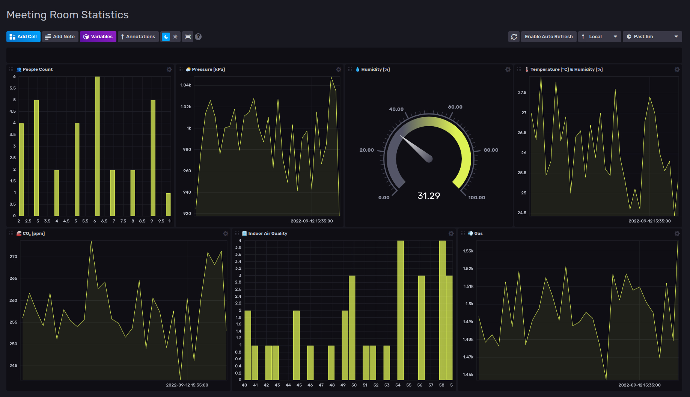

# Environmental monitoring with Arduino Pro

This project is a proof of concept for demonstrating environmental monitoring of offices by using the Arduino Pro Ecosystem.

For monitoring the environmental conditions we have chosen the Arduino Nicla Sense ME which is designed to easily analyze motion and the surrounding environment – hence the “M” and “E” in the name. It measures rotation, acceleration, pressure, humidity, temperature, air quality, and CO2 levels by introducing completely new Bosch Sensortec sensors on the market.

For monitoring the number of people in each room we have chosen the Arduino Nicla Vision which combines a powerful STM32H747AII6 Dual ARM® Cortex® M7/M4 IC processor with a 2MP color camera that supports TinyML, as well as a smart 6-axis motion sensor, integrated microphone, and distance sensor.

For the gateway we have chosen the Portenta X8 that is a powerful, industrial-grade SOM with Linux OS preloaded onboard, capable of running device-independent software thanks to its modular container architecture. It features an NXP® i.MX 8M Mini Cortex®-A53 quad-core, up to 1.8GHz per core + 1x Cortex®-M4 up to 400MHz, plus the STMicroelectronics STM32H747 dual-core Cortex®-M7 up to 480Mhz +M4 32 bit Arm® MCU up to 240Mhz.

The dashboard can be visualized by accessing the InfluxDB interface on the Portenta X8 IP on port 8086 in a browser on another computer (for example http://192.168.1.199:8086/).

## Getting Started

These instructions will give you a copy of the project up and running on your local machine for development and testing purposes. 

### Prerequisites

Hardware requirements: 
- [Nicla Sense Me](https://www.arduino.cc/pro/hardware/product/nicla-sense-me)
- [Nicla Vision](https://www.arduino.cc/pro/hardware/product/nicla-vision)
- [Portenta X8](https://www.arduino.cc/pro/hardware/product/portenta-x8)

Software requirements: 
- [Arduino IDE](https://www.arduino.cc/en/software)
- [Open MV](https://openmv.io/pages/download)
- [Edge Impulse free account](https://studio.edgeimpulse.com/signup)

Edge Impulse project link: https://studio.edgeimpulse.com/public/130101/latest

### Installing

#### Nicla Sense ME:
- install the Arduino IDE and the Nicla Sense ME board in it by following the steps in this [article](https://docs.arduino.cc/tutorials/nicla-sense-me/getting-started) ;
- clone this repository and set the workspace path in the Nicla Sense ME folder;
- connect the board to your laptop, then compile and upload the ble_sense_send sketch;

#### Nicla Vision:
- install the OpenMV IDE;
- download the [latest firmware release](https://github.com/openmv/openmv/releases/tag/v4.3.3) for Nicla Vision (older releases do not have Bluetooth enabled);
- connect the board to your laptop, go to Tools -> Run Bootloader (Load Firmware) -> select the Firmware Path -> Run ;
- copy all the files from the Nicla Vision folder to your board;

#### Portenta X8:
- boot the Portenta X8 by connecting it to a laptop through a USB Type-C in it, so you get the network connectivity for first time setup of the WiFi;
- use the bluetoothctl command line utility to pair with the devices and find out their MACs using scan, be sure to copy their actual MACs from the scan since you will be using them later as well. Repeat for both Nicla Sense and Nicla Vision the following comands in the terminal:

    bluetootctl
    power on
    scan on
    pair MAC
    connect MAC
    trust MAC

- clone this repository directly in the home of this device:

    git clone https://github.com/Zalmotek/arduino_environmental_monitoring_with_arduino_pro.git
    cd PortentaX8/python-ble-scanner
    vim Docker-compose.yml

- be sure to change the MAC ids for the Nicla Vision and Nicla Sense me accordingly with your devices found at the previouse step, then just build the container using docker-compose build and launch it with docker-compose up to start capturing data;

    docker-compose build
    docker-compose up

- go to the ip of the PortentaX8 in a browser to check the data arriving in the InfluxDB interface, be sure to add 8086 port after the ip and the username arduino and password x8blepass45 to access it;
- we have included the above dashboard template that you can import in the InfluxDB from the Boards button on the left side of the interface.

## Authors
   [Zalmotek team](https://zalmotek.com/)

## Acknowledgments
  - The amazing Arduino Documentation and support!

